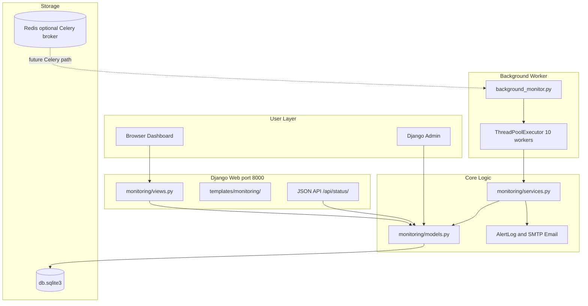
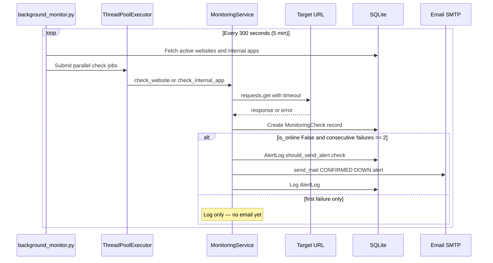

# Server Health Checker — Complete Project Guide
### (పూర్తి ప్రాజెక్ట్ గైడ్ — Easy Readable Version)

Mowa, ee document ni story laaga, paragraph format lo rasamu. Tables and bullet lists takkuva — prathi topic ni normal ga, ardam avvela explain chesamu. Ee document chadivithe project motham clear ga telustundi. Interview ki kuda, kotha person ki kuda ee guide chalu.

---

## Table of Contents

1. [What Is This Project?](#1-what-is-this-project)
2. [How to Start the Project](#2-how-to-start-the-project)
3. [Every File Explained](#3-every-file-explained)
4. [Database — How Data Is Stored](#4-database--how-data-is-stored)
5. [How Monitoring Works (Full Flow)](#5-how-monitoring-works-full-flow)
6. [URLs and APIs](#6-urls-and-apis)
7. [Tools and Technologies Used](#7-tools-and-technologies-used)
8. [Timing — How Often Things Happen](#8-timing--how-often-things-happen)
9. [Good Things and Problems (With Solutions)](#9-good-things-and-problems-with-solutions)
10. [Interview Questions and Answers](#10-interview-questions-and-answers)
11. [Important Code Files Explained](#11-important-code-files-explained)
12. [Deployment and Production](#12-deployment-and-production)

---

## 1. What Is This Project?

### The Main Idea

Server Health Checker ante oka **website monitoring system** mowa. Django framework use chesi build chesamu. Ee system mee websites and apps ni automatic ga check chestundi — bagunnaya leda ani. Site problem unte email alert pamputundi. Dashboard lo uptime percentage, response time, online/offline status chupistundi.

Ee project main purpose enti ante: **mee websites down ayyayi ani meeku fast ga teliyali**. Manam configure chesina URLs ki HTTP request pampistamu. Response correct ga vasthe site UP ani mark chestamu. Problem unte DOWN ani mark chesi email pamputamu.

### What This Project Does NOT Do

Important ga gurtu pettukondi mowa — ee project **server CPU, RAM, disk usage monitor cheyadu**. Adi vere type of monitoring. Manam cheseedi only **HTTP health check** — URL ki request pampi, 200 OK vasthe bagundani, leda problem undani decide chestamu. UptimeRobot lanti third-party API kuda use cheyamu. Direct ga mee URLs ki `requests.get()` pampistamu.

### How the System Is Built (Architecture)

Ee project lo **rendu separate programs** run avtayi. Idi interview lo chala important question.

**First process — Django Web Server:** Iddi browser lo dashboard chupinchadaniki. User website add cheyochu, edit cheyochu, stats chudochu. Port 8000 lo run avtundi. `manage.py runserver` command tho start avtundi.

**Second process — Background Monitor:** Iddi actual monitoring chese worker. `background_monitor.py` file run avtundi. **Prathi 5 minutes (300 seconds)** ki anni active websites ni check chestundi — value `.env` lo `MONITORING_INTERVAL=300` nundi vastundi. 10 sites parallel ga check avtayi — slow avvakunda. Ee process separate ga run avvali — lekapothe dashboard slow avtundi.

Rendu processes okate database (`db.sqlite3`) use chestayi. Django UI data chupistundi, background worker data update chestundi.

### When Is a Server UP or DOWN?

**UP (Online) ante** site bagundi ani ardam. Idi jaragadaniki moodu conditions satisfy avvali: first, HTTP connection successfully establish avvali. Second, server timeout lopala respond cheyali — default ga 30 seconds. Third, HTTP status code expected code tho match avvali — mostly 200 OK.

**DOWN (Offline) ante** site problem undi ani ardam. Idi jaragadaniki moodu reasons unnayi: timeout — server respond cheyyaledu; wrong status code — 500, 502, 404 lanti errors; connection error — DNS fail, server refuse, network problem.

**Important — email immediately radu:** Oka check DOWN aithe mail pampeyam. System **two-strike** rule follow chestundi: first DOWN ni log chestundi matrame; next 5-min cycle lo kuda DOWN unte confirmed outage ani email pamputundi. Idi false alarms tagginchadaniki.

Simple ga cheppali ante: URL ki request — 200 vasthe "UP". Error vasthe "DOWN" mark. **Rendu consecutive DOWN checks** tarvata matrame mail.

---

## 2. How to Start the Project

### Simple Summary in Telugu

Project start cheyadaniki flow idi: virtual environment create chey → libraries install chey → `.env` file setup chey → database create chey → admin user create chey → `start_all.bat` run chey. Anthe — rendu services start avtayi.

### Step-by-Step (Read Like a Story)

First, project folder lo vellali. Command Prompt or PowerShell open chesi `cd "C:\Users\VivekNookala\Desktop\server cheker"` type cheyandi.

Next, virtual environment create cheyandi — `python -m venv venv`. Tarvata activate cheyandi — `venv\Scripts\activate`. Virtual environment ante isolated space — mee system lo vere Python projects tho library clash avvadu.

Tarvata anni dependencies install cheyandi — `pip install -r requirements.txt`. Ee command `requirements.txt` file lo unna anni libraries install chestundi — Django, requests, celery, etc.

`.env` file create cheyali secrets kosam. `copy .env.example .env` run cheyandi. `.env` file open chesi `EMAIL_HOST_USER` and `EMAIL_HOST_PASSWORD` fill cheyandi — email alerts work avvadaniki idi mandatory mowa. Gmail use chesthe App Password kavali.

Database tables create cheyadaniki rendu commands run cheyandi: `python manage.py makemigrations` and `python manage.py migrate`. Ivi SQLite database lo tables create chestayi.

Admin panel access kosam superuser create cheyandi — `python manage.py createsuperuser`. Username, email, password enter cheyandi.

Finally, project start cheyadaniki `.\start_all.bat` run cheyandi. Ee batch file rendu command windows open chestundi — okati Django server (`http://127.0.0.1:8000`), inkokati background monitor. **Rendu run avvali** — okati matrame start chesthe monitoring work avvadu.

### Other Ways to Start

Manual ga start cheyali ante rendu separate terminals lo run cheyochu. Terminal 1: `python manage.py runserver`. Terminal 2: `python background_monitor.py`. Debugging ki idi useful.

Docker use cheyali ante `docker-compose up -d` — web, monitor, redis — moodu containers start avtayi.

Oka single check test cheyali ante `python manage.py run_monitoring` run cheyochu.

Celery kuda setup undi kani currently use avvatledu. Future lo `celery -A server_checker worker` and `celery -A server_checker beat` use cheyochu.

### After Starting — What to Do

Browser lo `http://127.0.0.1:8000/` open cheyandi — main dashboard kanipistundi. "Add Website" click chesi URL, alert email, expected status code enter cheyandi. Background monitor **prathi 5 minutes** ki automatic ga check start chestundi. Admin panel `http://127.0.0.1:8000/admin/` lo superuser login tho full data manage cheyochu.

---

## 3. Every File Explained

Mowa, project lo prathi file oka specific pani chestundi. Ikkada folder wise explain chesanu — story laaga chadivithe ardam avtundi.

### Root Folder Files

`manage.py` ante Django project ki main entry point. Migrations, runserver, createsuperuser — anni Django commands ee file dwara run avtayi.

`background_monitor.py` ante **monitoring heart** mowa. Ee file lekunte automatic checks jaragavu. **Prathi 5 minutes (300s)** ki loop run avtundi — `settings.MONITORING_INTERVAL` / `.env` nundi. Parallel ga sites check chestundi. Ee file chala important — interview lo definitely adugutaru.

`start_all.bat` ante Windows batch file — Django server and background monitor rendu okesari start cheyadaniki. Double-click cheste rendu command windows open avtayi.

`requirements.txt` lo project ki kavalsina Python libraries list undi — Django 4.2.7, requests, celery, redis, etc. `pip install -r requirements.txt` tho install avtayi.

`.env.example` ante template file — `.env` ela create cheyalo chupistundi. `.env` lo actual secrets untayi — email password, SECRET_KEY. Git lo upload cheyakudadhu.

`README.md` ante short setup guide. `PROJECT_COMPLETE_GUIDE.md` ante ee full document — purna project details ikkade.

`db.sqlite3` ante database file — migrate chesaka automatic ga create avtundi. Anni websites, checks, alerts ikkada store avtayi.

`Dockerfile`, `docker-compose.yml`, `Jenkinsfile` ante deployment files — Docker containers and Jenkins CI/CD pipeline kosam.

### `server_checker/` Folder — Django Configuration

`server_checker` ante Django project configuration folder. Actual business logic ikkada ledu — settings and routing ikkada untayi.

`settings.py` lo motham project settings unnayi — database (SQLite), email (SMTP), Celery, CORS, static files. `.env` file nundi values read chestundi `python-decouple` library dwara.

`urls.py` lo main URL routing undi — `/admin/` Django admin ki, `/` monitoring app ki redirect avtundi.

`wsgi.py` and `asgi.py` ante production servers (Gunicorn, Uvicorn) ki entry points.

`celery.py` lo Celery configuration undi — Redis broker, 300 second beat schedule. Kani currently production lo use avvatledu — `background_monitor.py` primary worker.

### `monitoring/` Folder — Main Application (Most Important)

`monitoring` folder lo actual project logic undi mowa. Ee folder chala important.

`models.py` lo 5 database tables define chesamu — Website, InternalApp, MonitoringCheck, AlertLog, MonitoringSettings. Data ela store avvalo ikkada define chesamu.

`services.py` lo core monitoring logic undi — HTTP checks cheyadam, alerts pamputadam, dashboard stats calculate cheyadam. `MonitoringService` and `MonitoringStats` classes ikkada unnayi.

`views.py` lo user requests handle avtayi — dashboard page, add website, edit, delete, JSON API. Browser nundi request vasthe e function run avvalo ikkada define chesamu.

`urls.py` lo monitoring app URL patterns unnayi — `/website/add/`, `/api/status/` lanti URLs ikkada map avtayi.

`forms.py` lo website and internal app add/edit forms unnayi — Bootstrap styling tho.

`signals.py` lo Django signals unnayi — website add chesinappudu confirmation email, delete chesinappudu notification email automatic ga pamputundi.

`tasks.py` lo Celery tasks unnayi kani currently use avvatledu — backup path ga undi.

`admin.py` lo Django admin panel customization undi — websites, checks, alerts admin lo manage cheyochu.

`apps.py` lo app register avtundi and signals load avtayi startup lo.

`management/commands/run_monitoring.py` ante terminal nundi single monitoring cycle run cheyadaniki CLI command.

### `templates/` Folder — HTML Pages

`base.html` ante common layout — navbar, Bootstrap, Font Awesome icons.

`status_page.html` ante home page — anni websites status, global stats.

`website_detail.html` ante oka website full details — checks history, internal apps, alerts.

`alerts_page.html` ante alert history with search.

Migata files — add, edit, delete forms for websites and internal apps.

### `static/` Folder

`static/css/custom.css` ante extra styling file — kani currently templates lo link cheyyaledu, so use avvatledu.

---

## 4. Database — How Data Is Stored

Database lo 5 tables unnayi mowa. Prathi table oka specific purpose ki. Interview lo "data model explain chey" ante ee story cheppu.

### Website Table

Website table lo main monitored URLs store avtayi. Oka website add chesinappudu name, URL, description, status (active/inactive/maintenance), timeout (default 30 seconds), expected status code (default 200), alert email — ivi save avtayi.

Website model lo `check_interval` field kuda undi — default 300 seconds (5 minutes). Background worker global ga `MONITORING_INTERVAL` (default 300) use chestundi. Per-website interval future enhancement — currently anni sites same 5-min global cycle lo check avtayi.

Website model lo 3 useful properties unnayi. `is_online` ante latest check result chusi online or offline decide chestundi. `last_check_time` ante last check eppudu jarigindo chupistundi. `uptime_percentage` ante last 20 checks lo enni successful — adi percentage lo calculate chestundi.

### InternalApp Table

InternalApp ante oka website kinda child endpoints — payment API, admin panel, landing page lanti vi. Oka main website kinda multiple internal apps monitor cheyochu. Prathi internal app ki separate URL, timeout, expected status code set cheyochu. Alerts parent website alert email ki vastayi.

### MonitoringCheck Table

MonitoringCheck ante oka single HTTP check result store chese table. Prathi check jariginappudu — time, online/offline, response time, status code, error message — anni ikkada save avtayi.

Smart feature undi — prathi check save ayyaka, dani kante purana checks delete avtayi. Oka target ki only last 20 checks matrame retain avtayi. Database size control lo untundi mowa.

### AlertLog Table

AlertLog ante pamputunna alert emails history. **Two-strike rule:** first DOWN check lo mail radu; second consecutive DOWN (next 5-min cycle) lo matrame DOWN alert vastundi. Tarvata site recover avvakunda DOWN undina, same outage ki repeat mail radu (`consecutive_failures == 2` only). Extra safety ki `should_send_alert()` cooldown kuda undi — default 5 minutes lo duplicate type alert skip.

Alerts dismiss cheyadaniki `is_cleared` field undi — dashboard lo kanipinchakunda hide cheyochu.

### MonitoringSettings Table

MonitoringSettings ante global settings — only one row database lo undali. Master on/off switch, global interval, max concurrent checks — ivi ikkada define chesamu. Kani chala fields actually worker use cheyadu — improvement area idi.

### How Tables Connect

Oka Website ki chaala InternalApps attach avvochu. Oka Website or InternalApp ki chaala MonitoringChecks history untundi. Oka Website ki chaala AlertLogs untayi. Simple chain: Website → InternalApp → MonitoringCheck → AlertLog.

---

## 5. How Monitoring Works (Full Flow)

Ee section chala important mowa — "monitoring ela work avtundi?" ante ee story cheppu.

### The Complete Story

User dashboard lo kotha website add chestadu. Form submit ayyaka data SQLite database lo Website table lo save avtundi. Django signal fire avtudi — confirmation email alert email ki vastundi.

Meanwhile, `background_monitor.py` **prathi 5 minutes** ki oka cycle run chestundi. Cycle start ayyaka, database nundi active websites (`status='active'`) and active internal apps (`is_active=True`) fetch chestundi.

Tarvata ThreadPoolExecutor use chesi 10 parallel threads lo checks run chestundi. Oka thread oka site check chestundi — slow avvakunda.

Prathi thread `MonitoringService.check_website()` or `check_internal_app()` call chestundi. Ee function monitored URL ki HTTP GET request pampistundi — `requests.get(url, timeout=30)`. Response time measure chestundi. Status code expected code tho compare chestundi.

Result `MonitoringCheck` table lo save avtundi. Site online unte — just save, alert emi radu. Site offline unte — `handle_website_alerts()` call avtundi.

**Two-strike email logic:** Recent checks lo consecutive failures count chestundi. Failure count == 1 → only log, no mail. Failure count == 2 → confirmed DOWN → SMTP email + AlertLog. Failure count >= 3 → already alerted, silent until recovery then new outage.

Dashboard latest checks database nundi read chesi stats chupistundi — uptime %, response time, online/offline status.

### When a Site Goes DOWN — Detailed Story (Interview Gold)

**Minute 0:** Monitor HTTP GET pampistundi. Timeout / 500 / connection error → `is_online=False`. MonitoringCheck save. Consecutive failures = 1. **Mail radu** — temporary blip avvochu.

**Minute 5:** Malli check. Malli DOWN → consecutive failures = 2. Ippudu confirmed outage. `AlertLog.send_alert()` → Gmail SMTP → admin ki email. Dashboard RED offline.

**Minute 10, 15...:** Inka DOWN unte consecutive = 3, 4... Email malli radu (same outage ki spam ledu). Site UP ayyi malli DOWN aithe cycle malli start — first fail silent, second fail email.

**Maintenance mode:** `website.status = 'maintenance'` unte checks jaragavochu kani alerts skip.

### When You Add a New Website

Form fill chesi submit chestavu. WebsiteForm validate chesi database lo save chestundi. Signal fire avtundi — "new website added" confirmation email vastundi. Next monitoring cycle (**5 minutes lopala**) automatic ga kotha website pick up chestundi. Manual ga emi cheyalsina avasaram ledu.

### Manual Check Button

Website detail page lo "Check Now" button unte — adi click cheste wait cheyakunda instant check trigger avtundi. `POST /website/<id>/check/` endpoint call avtundi. Oka website and dani internal apps check avtayi. JSON response vastundi — success or error.

---

## 6. URLs and APIs

Ee project lo rendu types of endpoints unnayi — browser ki HTML pages, programs ki JSON API.

### Main Pages You Use in Browser

Home page `http://127.0.0.1:8000/` — main dashboard, anni sites status kanipistundi. Alerts page `/alerts/` — alert history with search. Add website `/website/add/` — kotha site add cheyadaniki form. Website details `/website/<id>/` — oka site full info, checks history, internal apps. Edit `/website/<id>/edit/`, Delete `/website/<id>/delete/` — site manage cheyadaniki. Internal apps add/edit/delete kuda similar URLs unnayi. Admin panel `/admin/` — superuser login tho full backend access.

### JSON API

`GET /api/status/` ante main JSON API. Login avasaram ledu currently. Response lo global stats (total sites, online/offline count, overall uptime) and prathi website details (name, URL, status, uptime %, last check time, response time) vastayi. External tools or scripts ee API use chesi status fetch cheyochu.

Manual check `POST /website/<id>/check/` — instant check trigger, JSON response. Alert clear `POST /alert/<id>/clear/` — alert dismiss cheyadaniki.

### External Services This Project Uses

Monitored URLs ki direct HTTP GET requests — `requests` library use chestundi. Third-party monitoring API emi use cheyadu.

Email alerts kosam SMTP use chestundi — default Gmail (`smtp.gmail.com:587` with TLS). `.env` lo email credentials configure cheyali.

Redis Celery broker kosam setup undi. **Honest answer for interview:** Active monitoring path Redis use cheyadu — `background_monitor.py` + SQLite. Redis docker-compose lo undi future Celery Beat/Worker scaling kosam. Currently `CELERY_TASK_ALWAYS_EAGER=True` so Celery tasks in-process run avtayi, Redis mandatory kadu local run ki.

---

## 7. Tools and Technologies Used

Ee project Python lo build chesamu — version 3.8 or above. Docker lo 3.11 use chestundi.

Django 4.2.7 ante main web framework — ORM (database), admin panel, forms, URL routing — anni Django provide chestundi. Web app skeleton Django eh.

`requests` library HTTP health checks kosam — monitored URLs ki GET request pampadaniki. Version 2.31.0.

SQLite ante database — file based, setup avasaram ledu, development ki perfect. Production lo PostgreSQL recommend chestamu.

ThreadPoolExecutor ante Python built-in — 10 sites parallel ga check cheyadaniki. Okasari oka site wait cheyakunda parallel run avtayi.

Bootstrap 5 and Font Awesome ante dashboard UI — CDN nundi load avtayi. Nice look and icons.

`django-crispy-forms` and `crispy-bootstrap5` ante forms baga kanipinchela Bootstrap styling.

`python-decouple` ante `.env` file nundi secrets safe ga read cheyadaniki — passwords code lo undavu.

Celery and Redis ante async task queue — **future scaling kosam** docker-compose + settings lo setup. Currently primary worker `background_monitor.py` (ThreadPoolExecutor + sleep). Interview lo cheppu: "Redis is the Celery message broker for the planned async path; production checks today run via a dedicated background process."

### Where Is Redis Used? (Clear Interview Answer)

| Place | Role |
|-------|------|
| `settings.py` `CELERY_BROKER_URL` / `CELERY_RESULT_BACKEND` | Points Celery at Redis |
| `docker-compose.yml` `redis` service | Runs Redis 7 Alpine container |
| `requirements.txt` `redis` + `celery` | Client libraries |
| `server_checker/celery.py` beat schedule | Would enqueue checks every 300s via Redis |

**Why Redis?** Celery workers need a broker to hold queued tasks. Redis is fast in-memory store — perfect as a queue. Without Redis, Celery Beat cannot hand work to workers across processes/machines.

**Why not used every day now?** Design chose a simpler reliable path first: one `background_monitor.py` loop. Fewer moving parts for a small deployment. Redis stays ready when you scale to many workers or multi-server deploys.

Docker and docker-compose ante containerized deployment — production lo easy deploy.

Jenkins ante CI/CD pipeline — code push aithe automatic build and deploy.

SMTP/Gmail ante email alerts — site DOWN aithe mail vastundi.

`Pillow` and `django-extensions` requirements lo unnayi kani code lo actually use cheyyaledu — leftover or future kosam.

---

## 8. Timing — How Often Things Happen

Idi interview lo chala important topic mowa.

Background monitor **prathi 300 seconds (5 minutes)** ki oka full check cycle run chestundi. Value `.env` → `MONITORING_INTERVAL=300` → `settings.MONITORING_INTERVAL` → `background_monitor.py` lo `time.sleep(CHECK_INTERVAL)`.

**Two-strike alert timing:**
- Check interval = 5 min
- First DOWN → no email
- Second DOWN (~10 min after first failure started) → email once
- Further DOWNs in same outage → no repeat email

HTTP request timeout per website — default 30 seconds. Actually use avtundi — `requests.get(url, timeout=website.timeout)`.

Alert cooldown — `MonitoringSettings.alert_cooldown_minutes` (default 5) — extra duplicate guard beyond two-strike.

Check history — last 20 checks per target. Stats same 20-check window. Dashboard page auto-refresh — 5 minutes (`base.html` 300000 ms). ThreadPool — 10 parallel workers. Celery beat also 300s (backup path, not primary).

---

## 9. Good Things and Problems (With Solutions)

### What Is Good About This Project

Architecture simple ga undi — interview lo explain cheyadaniki easy. ThreadPoolExecutor valla 30+ sites parallel check. **Two-strike email** — false positive blips ki mail radu; confirmed outage (~10 min) tarvata matrame alert. Website and InternalApp hierarchy. Dashboard, Django Admin, JSON API. Docker and Jenkins ready. Check history auto-prune. Maintenance mode. Manual check button. Alerts dismiss.

### Problems and How to Fix Them

Per-website `check_interval` still not honored individually — all sites share global `MONITORING_INTERVAL`. Fix: track last check time and skip until each site's interval elapsed.

Recovery emails pamputledu — `send_recovery_email` field undi kani logic ledu. Fix: previous offline → current online transition detect chesi recovery email.

SQLite parallel writes ki problem — scale ayyaka lock. Fix: PostgreSQL.

Dashboard lo login ledu. Fix: `@login_required`.

`CORS_ALLOW_ALL_ORIGINS = True` — production lo restrict.

Celery configured kani primary path kadu — confusion. Fix: switch to Celery Beat OR document clearly (we document Redis as future broker).

Celery `check_single_website` task bug — calls `run_monitoring_cycle()` instead of `check_website()`.

Unit tests levu. `custom.css` unused. Production DEBUG/SECRET_KEY/HTTPS hardening needed.

---

## 10. Interview Questions and Answers

Mowa, ee questions interview lo adagochu. Paragraph format lo answer chadivithe easy ga cheppagalavu.

**Q: What does this project do? (30-second elevator pitch)**

Answer: I built a Django-based HTTP uptime monitoring system. You add website and API URLs, a background worker probes them every 5 minutes in parallel, and if a target stays down for two consecutive checks (~10 minutes), it emails an alert. The dashboard shows online/offline status, response time, and uptime from the last 20 checks. (Resume line: "Django HTTP health checker with parallel probes, two-strike email alerts, and uptime dashboard.")

**Q: How do you know a server is UP or DOWN?**

Answer: I send an HTTP GET to the URL with a configurable timeout (default 30s). If the status code matches the expected code (usually 200), it's UP. Timeout, connection error, or wrong status → DOWN. We do not monitor CPU/RAM — only HTTP reachability, like a lightweight UptimeRobot clone.

**Q: Walk me through what happens when a website goes down.**

Answer: At minute 0 the worker gets a failed request, saves a MonitoringCheck with is_online=False, counts consecutive failures = 1, and does **not** email — that avoids alerting on a one-off blip. Five minutes later it checks again. If still down, consecutive failures = 2, so we send one SMTP alert and log it in AlertLog. Further failures in the same outage do not spam. If it recovers and fails again later, the two-strike cycle restarts. Maintenance mode skips alerts entirely.

**Q: Why two separate processes?**

Answer: Django serves the UI and must stay responsive. Each health check can block up to 30 seconds. Running dozens of checks inside request threads would freeze the dashboard. So Django handles CRUD/API, and `background_monitor.py` owns the probe loop.

**Q: Why ThreadPoolExecutor?**

Answer: Sequential checks for 30+ sites with 30s timeouts could take many minutes per cycle. Ten parallel workers finish a cycle much faster without overloading SQLite or remote hosts.

**Q: How do you prevent alert spam?**

Answer: Two layers. First, **two-strike confirmation** — email only when consecutive_failures == 2. Second, **AlertLog.should_send_alert()** cooldown (default 5 minutes) so duplicate alert types are not resent in the window.

**Q: Where do you use Redis and why?**

Answer: Redis is configured as the Celery broker and result backend (`CELERY_BROKER_URL=redis://localhost:6379/0`) and runs as a service in docker-compose. Celery would push periodic check tasks through Redis so workers can scale horizontally. **Today the live path does not require Redis** — checks run in `background_monitor.py`. Redis is there for the production scaling path. Being honest about this shows you understand architecture trade-offs.

**Q: Why not use Redis for storing check status?**

Answer: Check results and alert history need durable, queryable storage for the dashboard and uptime %. SQLite (or PostgreSQL in prod) fits that. Redis shines as a fast queue/cache, not as our primary history store.

**Q: What database and why?**

Answer: SQLite for development — zero setup, file-based. For production with concurrent writes I'd migrate to PostgreSQL.

**Q: Explain the data model.**

Answer: Website is the top-level monitored URL. InternalApp is a child endpoint (API, admin, frontend). MonitoringCheck stores each probe. AlertLog stores sent emails. MonitoringSettings holds global flags. Chain: Website → InternalApp → MonitoringCheck / AlertLog.

**Q: What is Celery doing here?**

Answer: Celery + Redis + beat schedule (300s) is an alternate async design. Primary worker is still `background_monitor.py`. `CELERY_TASK_ALWAYS_EAGER=True` makes Celery tasks run synchronously if invoked — useful for local/dev without a live broker.

**Q: How would you scale this?**

Answer: PostgreSQL; make Celery Beat the scheduler and workers consume via Redis; multiple monitor replicas; login on the dashboard; Nginx + Gunicorn; per-site intervals; recovery emails; container orchestration (Swarm/K8s).

**Q: Website vs InternalApp?**

Answer: Website = `https://mysite.com`. InternalApp = `https://api.mysite.com/health`. Checked independently; alerts go to the parent website's email.

**Q: How is uptime calculated?**

Answer: Last 20 MonitoringCheck rows → (online_count / total) × 100.

**Q: What happens when you add a website?**

Answer: Form save → signal confirmation email → picked up on the next 5-minute cycle (or immediately via Check Now).

**Q: Maintenance mode?**

Answer: status='maintenance' → checks may still run, alerts suppressed for planned downtime.

**Q: Development vs production email?**

Answer: Dev can use console backend (prints to terminal). Prod uses SMTP (e.g. Gmail App Password) from `.env`.

**Q: Why keep only 20 checks?**

Answer: Auto-prune in MonitoringCheck.save() keeps DB small and queries fast.

**Q: Docker?**

Answer: Three services — web (Django), monitor (background_monitor.py), redis (Celery broker). `docker-compose up -d`.

**Q: What would you improve next?**

Answer: Recovery emails, auth, PostgreSQL, honor per-website intervals, unit tests, fix Celery single-site task, restrict CORS, HTTPS.

**Q: Resume bullet ideas?**

Answer:
- Built a Django uptime monitor with parallel HTTP health checks every 5 minutes
- Implemented two-strike downtime confirmation to cut false-positive email alerts
- Designed dual-process architecture (web UI + background worker) with optional Celery/Redis scaling path
- Delivered dashboard metrics (uptime %, latency, status) and SMTP alerting with alert history

**Q: Project folder structure?**

Answer: Root entry points (`manage.py`, `background_monitor.py`). `server_checker/` config. `monitoring/` business logic. `templates/` UI. Docker/Jenkins for deploy.

---

## 11. Important Code Files Explained

### `background_monitor.py` — The Monitoring Heart

Ee file lekunte monitoring work avvadu mowa. File start lo Django setup avtundi — `django.setup()` — because ee file `manage.py` tho run avvadu, separate process. Models and services access cheyadaniki setup mandatory.

`check_target()` function oka thread lo oka site check chestundi. Website or internal app — `MonitoringService` call chestundi. Error vasthe crash avvadu — print chesi continue.

`run_professional_monitoring()` oka full cycle. Active websites and internal apps database nundi fetch. ThreadPoolExecutor (10 workers) lo prathi target submit. Parallel execution — fast.

`if __name__ == "__main__"` block lo infinite loop — `while True`: run cycle, `time.sleep(CHECK_INTERVAL)` where CHECK_INTERVAL comes from `MONITORING_INTERVAL` (default 300 = 5 minutes).

### `monitoring/services.py` — Core Logic

`MonitoringService` — HTTP checks + two-strike alerts. `check_website()` / `check_internal_app()` probe with `requests.get()`, save MonitoringCheck, call alert handlers. Handlers require **exactly 2 consecutive failures** before SMTP email. `MonitoringStats` builds dashboard numbers from last 20 checks.

### `monitoring/models.py` — Database

5 models — Website, InternalApp, MonitoringCheck, AlertLog, MonitoringSettings. Properties: `is_online`, `uptime_percentage`. `MonitoringCheck.save()` auto-prune 20 checks. `AlertLog.should_send_alert()` 5-min cooldown. `AlertLog.send_alert()` email + log.

### `monitoring/views.py` — Request Handlers

`status_page` — dashboard. `website_detail` — single site. `add_website`, `edit_website`, `delete_website` — CRUD. `manual_check` — instant check JSON. `api_status` — JSON API. `alerts_page`, `clear_alert`, `clear_all_alerts` — alert management.

### `monitoring/urls.py` — URL Map

Browser URLs ni view functions ki connect chestundi. `app_name = 'monitoring'` for namespaced URLs.

### `server_checker/settings.py` — Configuration

SECRET_KEY, DEBUG, ALLOWED_HOSTS from `.env`. SQLite database. Email SMTP config. Celery Redis broker URLs. CORS. **MONITORING_INTERVAL=300 used by background_monitor**. Dev email can be console; prod SMTP.

---

## 12. Deployment and Production

### Docker

Production lo Docker use cheste easy deploy. `docker-compose.yml` lo 3 services: `web` (Django port 8000), `monitor` (background_monitor.py, auto-restart), `redis` (Celery broker). `docker-compose up -d` tho start. `docker-compose logs -f monitor` tho monitor logs chudochu. `docker-compose down` tho stop.

Dockerfile Python 3.11-slim base, requirements install, port 8000 expose.

### Jenkins CI/CD

Jenkins pipeline: Checkout code → copy `.env.example` to `.env` if needed → `docker-compose build` → `docker-compose up -d` deploy → cleanup old images. Test stage commented out — no unit tests yet.

### Production Checklist

Production ki deploy cheyadaniki: strong SECRET_KEY, DEBUG=False, ALLOWED_HOSTS with domain, PostgreSQL, real SMTP, restrict CORS, add login to dashboard, HTTPS with Nginx, Gunicorn instead of runserver, collectstatic, ensure background_monitor runs as service, database backups.

`.env` variables: SECRET_KEY, DEBUG, ALLOWED_HOSTS, EMAIL_* settings, CELERY_BROKER_URL, MONITORING_INTERVAL (fix to use it).

---

## Quick Summary for Interview

**One line:** Django HTTP uptime monitor — parallel checks every 5 minutes, two-strike email alerts, real-time dashboard.

**Tech:** Python, Django 4.2.7, SQLite, requests, ThreadPoolExecutor, Bootstrap, SMTP; Redis+Celery ready for scale.

**Architecture:** Two processes — Django (UI) + background_monitor.py (every 300s, 10 parallel workers).

**UP/DOWN:** HTTP GET → expected status within timeout = UP. Else DOWN. Email only after **2 consecutive DOWN** checks (~10 min).

**Redis:** Celery message broker in docker-compose/settings — not on the hot path today; used when scaling with Celery workers.

**Models:** Website → InternalApp → MonitoringCheck → AlertLog.

**Start:** `.\start_all.bat` or `docker-compose up -d`. Restart the Health Monitor window after code changes so the 5-min loop picks up.

**Resume tip:** Emphasize dual-process design, two-strike false-positive reduction, and clear path from SQLite+background worker → PostgreSQL+Celery+Redis.

Mowa, ee document chadivithe project motham clear ga telustundi. Interview lo confidence tho explain cheyagalavu. Good luck!

---

*For quick setup steps only, see [README.md](README.md).*
