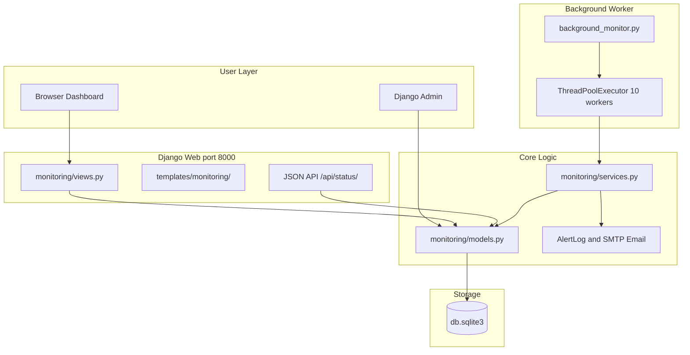
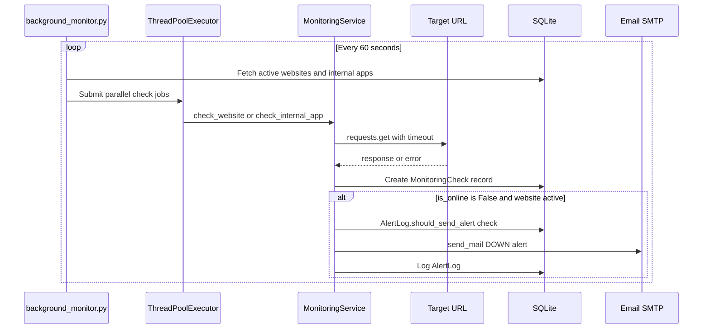

# Server Health Checker — Complete Project Guide
### (పూర్తి ప్రాజెక్ట్ గైడ్ — Easy Readable Version)

Mowa, ee document ni story laaga, paragraph format lo rasamu. Tables and bullet lists takkuva — prathi topic ni normal ga, ardam avvela explain chesamu. Ee document chadivithe project motham clear ga telustundi. Interview ki kuda, kotha person ki kuda ee guide chalu.

---

## Table of Contents

1. [What Is This Project?](#1-what-is-this-project)
2. [How to Start the Project](#2-how-to-start-the-project)
3. [Every File Explained](#3-every-file-explained)
4. [Database — How Data Is Stored](#4-database--how-data-is-stored)
5. [How Monitoring Works (Full Flow)](#5-how-monitoring-works-full-flow)
6. [URLs and APIs](#6-urls-and-apis)
7. [Tools and Technologies Used](#7-tools-and-technologies-used)
8. [Timing — How Often Things Happen](#8-timing--how-often-things-happen)
9. [Good Things and Problems (With Solutions)](#9-good-things-and-problems-with-solutions)
10. [Interview Questions and Answers](#10-interview-questions-and-answers)
11. [Important Code Files Explained](#11-important-code-files-explained)
12. [Deployment and Production](#12-deployment-and-production)

---

## 1. What Is This Project?

### The Main Idea

Server Health Checker ante oka **website monitoring system** mowa. Django framework use chesi build chesamu. Ee system mee websites and apps ni automatic ga check chestundi — bagunnaya leda ani. Site problem unte email alert pamputundi. Dashboard lo uptime percentage, response time, online/offline status chupistundi.

Ee project main purpose enti ante: **mee websites down ayyayi ani meeku fast ga teliyali**. Manam configure chesina URLs ki HTTP request pampistamu. Response correct ga vasthe site UP ani mark chestamu. Problem unte DOWN ani mark chesi email pamputamu.

### What This Project Does NOT Do

Important ga gurtu pettukondi mowa — ee project **server CPU, RAM, disk usage monitor cheyadu**. Adi vere type of monitoring. Manam cheseedi only **HTTP health check** — URL ki request pampi, 200 OK vasthe bagundani, leda problem undani decide chestamu. UptimeRobot lanti third-party API kuda use cheyamu. Direct ga mee URLs ki `requests.get()` pampistamu.

### How the System Is Built (Architecture)

Ee project lo **rendu separate programs** run avtayi. Idi interview lo chala important question.

**First process — Django Web Server:** Iddi browser lo dashboard chupinchadaniki. User website add cheyochu, edit cheyochu, stats chudochu. Port 8000 lo run avtundi. `manage.py runserver` command tho start avtundi.

**Second process — Background Monitor:** Iddi actual monitoring chese worker. `background_monitor.py` file run avtundi. Prathi 60 seconds ki anni active websites ni check chestundi. 10 sites parallel ga check avtayi — slow avvakunda. Ee process separate ga run avvali — lekapothe dashboard slow avtundi.

Rendu processes okate database (`db.sqlite3`) use chestayi. Django UI data chupistundi, background worker data update chestundi.

### When Is a Server UP or DOWN?

**UP (Online) ante** site bagundi ani ardam. Idi jaragadaniki moodu conditions satisfy avvali: first, HTTP connection successfully establish avvali. Second, server timeout lopala respond cheyali — default ga 30 seconds. Third, HTTP status code expected code tho match avvali — mostly 200 OK.

**DOWN (Offline) ante** site problem undi ani ardam. Idi jaragadaniki moodu reasons unnayi: timeout — server respond cheyyaledu; wrong status code — 500, 502, 404 lanti errors; connection error — DNS fail, server refuse, network problem.

Simple ga cheppali ante mowa: URL ki request pampamu — 200 vasthe "UP", timeout or error vasthe "DOWN — mail pamputamu."

---

## 2. How to Start the Project

### Simple Summary in Telugu

Project start cheyadaniki flow idi: virtual environment create chey → libraries install chey → `.env` file setup chey → database create chey → admin user create chey → `start_all.bat` run chey. Anthe — rendu services start avtayi.

### Step-by-Step (Read Like a Story)

First, project folder lo vellali. Command Prompt or PowerShell open chesi `cd "C:\Users\VivekNookala\Desktop\server cheker"` type cheyandi.

Next, virtual environment create cheyandi — `python -m venv venv`. Tarvata activate cheyandi — `venv\Scripts\activate`. Virtual environment ante isolated space — mee system lo vere Python projects tho library clash avvadu.

Tarvata anni dependencies install cheyandi — `pip install -r requirements.txt`. Ee command `requirements.txt` file lo unna anni libraries install chestundi — Django, requests, celery, etc.

`.env` file create cheyali secrets kosam. `copy .env.example .env` run cheyandi. `.env` file open chesi `EMAIL_HOST_USER` and `EMAIL_HOST_PASSWORD` fill cheyandi — email alerts work avvadaniki idi mandatory mowa. Gmail use chesthe App Password kavali.

Database tables create cheyadaniki rendu commands run cheyandi: `python manage.py makemigrations` and `python manage.py migrate`. Ivi SQLite database lo tables create chestayi.

Admin panel access kosam superuser create cheyandi — `python manage.py createsuperuser`. Username, email, password enter cheyandi.

Finally, project start cheyadaniki `.\start_all.bat` run cheyandi. Ee batch file rendu command windows open chestundi — okati Django server (`http://127.0.0.1:8000`), inkokati background monitor. **Rendu run avvali** — okati matrame start chesthe monitoring work avvadu.

### Other Ways to Start

Manual ga start cheyali ante rendu separate terminals lo run cheyochu. Terminal 1: `python manage.py runserver`. Terminal 2: `python background_monitor.py`. Debugging ki idi useful.

Docker use cheyali ante `docker-compose up -d` — web, monitor, redis — moodu containers start avtayi.

Oka single check test cheyali ante `python manage.py run_monitoring` run cheyochu.

Celery kuda setup undi kani currently use avvatledu. Future lo `celery -A server_checker worker` and `celery -A server_checker beat` use cheyochu.

### After Starting — What to Do

Browser lo `http://127.0.0.1:8000/` open cheyandi — main dashboard kanipistundi. "Add Website" click chesi URL, alert email, expected status code enter cheyandi. Background monitor 60 seconds lopala automatic ga check start chestundi. Admin panel `http://127.0.0.1:8000/admin/` lo superuser login tho full data manage cheyochu.

---

## 3. Every File Explained

Mowa, project lo prathi file oka specific pani chestundi. Ikkada folder wise explain chesanu — story laaga chadivithe ardam avtundi.

### Root Folder Files

`manage.py` ante Django project ki main entry point. Migrations, runserver, createsuperuser — anni Django commands ee file dwara run avtayi.

`background_monitor.py` ante **monitoring heart** mowa. Ee file lekunte automatic checks jaragavu. Prathi 60 seconds ki loop run avtundi, parallel ga sites check chestundi. Ee file chala important — interview lo definitely adugutaru.

`start_all.bat` ante Windows batch file — Django server and background monitor rendu okesari start cheyadaniki. Double-click cheste rendu command windows open avtayi.

`requirements.txt` lo project ki kavalsina Python libraries list undi — Django 4.2.7, requests, celery, redis, etc. `pip install -r requirements.txt` tho install avtayi.

`.env.example` ante template file — `.env` ela create cheyalo chupistundi. `.env` lo actual secrets untayi — email password, SECRET_KEY. Git lo upload cheyakudadhu.

`README.md` ante short setup guide. `PROJECT_COMPLETE_GUIDE.md` ante ee full document — purna project details ikkade.

`db.sqlite3` ante database file — migrate chesaka automatic ga create avtundi. Anni websites, checks, alerts ikkada store avtayi.

`Dockerfile`, `docker-compose.yml`, `Jenkinsfile` ante deployment files — Docker containers and Jenkins CI/CD pipeline kosam.

### `server_checker/` Folder — Django Configuration

`server_checker` ante Django project configuration folder. Actual business logic ikkada ledu — settings and routing ikkada untayi.

`settings.py` lo motham project settings unnayi — database (SQLite), email (SMTP), Celery, CORS, static files. `.env` file nundi values read chestundi `python-decouple` library dwara.

`urls.py` lo main URL routing undi — `/admin/` Django admin ki, `/` monitoring app ki redirect avtundi.

`wsgi.py` and `asgi.py` ante production servers (Gunicorn, Uvicorn) ki entry points.

`celery.py` lo Celery configuration undi — Redis broker, 300 second beat schedule. Kani currently production lo use avvatledu — `background_monitor.py` primary worker.

### `monitoring/` Folder — Main Application (Most Important)

`monitoring` folder lo actual project logic undi mowa. Ee folder chala important.

`models.py` lo 5 database tables define chesamu — Website, InternalApp, MonitoringCheck, AlertLog, MonitoringSettings. Data ela store avvalo ikkada define chesamu.

`services.py` lo core monitoring logic undi — HTTP checks cheyadam, alerts pamputadam, dashboard stats calculate cheyadam. `MonitoringService` and `MonitoringStats` classes ikkada unnayi.

`views.py` lo user requests handle avtayi — dashboard page, add website, edit, delete, JSON API. Browser nundi request vasthe e function run avvalo ikkada define chesamu.

`urls.py` lo monitoring app URL patterns unnayi — `/website/add/`, `/api/status/` lanti URLs ikkada map avtayi.

`forms.py` lo website and internal app add/edit forms unnayi — Bootstrap styling tho.

`signals.py` lo Django signals unnayi — website add chesinappudu confirmation email, delete chesinappudu notification email automatic ga pamputundi.

`tasks.py` lo Celery tasks unnayi kani currently use avvatledu — backup path ga undi.

`admin.py` lo Django admin panel customization undi — websites, checks, alerts admin lo manage cheyochu.

`apps.py` lo app register avtundi and signals load avtayi startup lo.

`management/commands/run_monitoring.py` ante terminal nundi single monitoring cycle run cheyadaniki CLI command.

### `templates/` Folder — HTML Pages

`base.html` ante common layout — navbar, Bootstrap, Font Awesome icons.

`status_page.html` ante home page — anni websites status, global stats.

`website_detail.html` ante oka website full details — checks history, internal apps, alerts.

`alerts_page.html` ante alert history with search.

Migata files — add, edit, delete forms for websites and internal apps.

### `static/` Folder

`static/css/custom.css` ante extra styling file — kani currently templates lo link cheyyaledu, so use avvatledu.

---

## 4. Database — How Data Is Stored

Database lo 5 tables unnayi mowa. Prathi table oka specific purpose ki. Interview lo "data model explain chey" ante ee story cheppu.

### Website Table

Website table lo main monitored URLs store avtayi. Oka website add chesinappudu name, URL, description, status (active/inactive/maintenance), timeout (default 30 seconds), expected status code (default 200), alert email — ivi save avtayi.

Website model lo `check_interval` field kuda undi — default 300 seconds (5 minutes). Kani **important gap** — ee field database lo store avtundi kani background worker actually use cheyadu. Worker prathi 60 seconds ki check chestundi.

Website model lo 3 useful properties unnayi. `is_online` ante latest check result chusi online or offline decide chestundi. `last_check_time` ante last check eppudu jarigindo chupistundi. `uptime_percentage` ante last 20 checks lo enni successful — adi percentage lo calculate chestundi.

### InternalApp Table

InternalApp ante oka website kinda child endpoints — payment API, admin panel, landing page lanti vi. Oka main website kinda multiple internal apps monitor cheyochu. Prathi internal app ki separate URL, timeout, expected status code set cheyochu. Alerts parent website alert email ki vastayi.

### MonitoringCheck Table

MonitoringCheck ante oka single HTTP check result store chese table. Prathi check jariginappudu — time, online/offline, response time, status code, error message — anni ikkada save avtayi.

Smart feature undi — prathi check save ayyaka, dani kante purana checks delete avtayi. Oka target ki only last 20 checks matrame retain avtayi. Database size control lo untundi mowa.

### AlertLog Table

AlertLog ante pamputunna alert emails history. Oka site DOWN aithe prathi minute mail pampute spam avtundi kada — anduke 5 minutes lo oka sari matrame DOWN alert pamputundi. `should_send_alert()` method ee check chestundi.

Alerts dismiss cheyadaniki `is_cleared` field undi — dashboard lo kanipinchakunda hide cheyochu.

### MonitoringSettings Table

MonitoringSettings ante global settings — only one row database lo undali. Master on/off switch, global interval, max concurrent checks — ivi ikkada define chesamu. Kani chala fields actually worker use cheyadu — improvement area idi.

### How Tables Connect

Oka Website ki chaala InternalApps attach avvochu. Oka Website or InternalApp ki chaala MonitoringChecks history untundi. Oka Website ki chaala AlertLogs untayi. Simple chain: Website → InternalApp → MonitoringCheck → AlertLog.

---

## 5. How Monitoring Works (Full Flow)

Ee section chala important mowa — "monitoring ela work avtundi?" ante ee story cheppu.

### The Complete Story

User dashboard lo kotha website add chestadu. Form submit ayyaka data SQLite database lo Website table lo save avtundi. Django signal fire avtudi — confirmation email alert email ki vastundi.

Meanwhile, `background_monitor.py` prathi 60 seconds ki oka cycle run chestundi. Cycle start ayyaka, database nundi active websites (`status='active'`) and active internal apps (`is_active=True`) fetch chestundi.

Tarvata ThreadPoolExecutor use chesi 10 parallel threads lo checks run chestundi. Oka thread oka site check chestundi — slow avvakunda.

Prathi thread `MonitoringService.check_website()` or `check_internal_app()` call chestundi. Ee function monitored URL ki HTTP GET request pampistundi — `requests.get(url, timeout=30)`. Response time measure chestundi. Status code expected code tho compare chestundi.

Result `MonitoringCheck` table lo save avtundi. Site online unte — just save, alert emi radu. Site offline unte — `handle_website_alerts()` call avtundi. Website active unte and 5 minutes lo same alert pampeyaledu ante — DOWN alert email pamputundi via SMTP. AlertLog lo record create avtundi.

Dashboard latest checks database nundi read chesi stats chupistundi — uptime %, response time, online/offline status.

### When a Site Goes DOWN — Detailed Story

Background monitor loop run avtundi. Active websites list teesukuntundi. ThreadPool lo prathi site ki thread assign avtundi. `requests.get()` pampistundi — timeout, connection error, or wrong status code vasthe `is_online = False` set avtundi. MonitoringCheck record database lo save avtundi with error details.

`handle_website_alerts()` check chestundi — website maintenance mode lo leda? Maintenance lo unte alert skip. Offline unte — last 5 minutes lo same alert pampeyaleda? Ledu ante email pamputundi. Dashboard lo site RED offline ga kanipistundi.

### When You Add a New Website

Form fill chesi submit chestavu. WebsiteForm validate chesi database lo save chestundi. Signal fire avtundi — "new website added" confirmation email vastundi. Next monitoring cycle (60 seconds lopala) automatic ga kotha website pick up chestundi. Manual ga emi cheyalsina avasaram ledu.

### Manual Check Button

Website detail page lo "Check Now" button unte — adi click cheste wait cheyakunda instant check trigger avtundi. `POST /website/<id>/check/` endpoint call avtundi. Oka website and dani internal apps check avtayi. JSON response vastundi — success or error.

---

## 6. URLs and APIs

Ee project lo rendu types of endpoints unnayi — browser ki HTML pages, programs ki JSON API.

### Main Pages You Use in Browser

Home page `http://127.0.0.1:8000/` — main dashboard, anni sites status kanipistundi. Alerts page `/alerts/` — alert history with search. Add website `/website/add/` — kotha site add cheyadaniki form. Website details `/website/<id>/` — oka site full info, checks history, internal apps. Edit `/website/<id>/edit/`, Delete `/website/<id>/delete/` — site manage cheyadaniki. Internal apps add/edit/delete kuda similar URLs unnayi. Admin panel `/admin/` — superuser login tho full backend access.

### JSON API

`GET /api/status/` ante main JSON API. Login avasaram ledu currently. Response lo global stats (total sites, online/offline count, overall uptime) and prathi website details (name, URL, status, uptime %, last check time, response time) vastayi. External tools or scripts ee API use chesi status fetch cheyochu.

Manual check `POST /website/<id>/check/` — instant check trigger, JSON response. Alert clear `POST /alert/<id>/clear/` — alert dismiss cheyadaniki.

### External Services This Project Uses

Monitored URLs ki direct HTTP GET requests — `requests` library use chestundi. Third-party monitoring API emi use cheyadu.

Email alerts kosam SMTP use chestundi — default Gmail (`smtp.gmail.com:587` with TLS). `.env` lo email credentials configure cheyali.

Redis Celery broker kosam setup undi kani production lo actively use avvatledu.

---

## 7. Tools and Technologies Used

Ee project Python lo build chesamu — version 3.8 or above. Docker lo 3.11 use chestundi.

Django 4.2.7 ante main web framework — ORM (database), admin panel, forms, URL routing — anni Django provide chestundi. Web app skeleton Django eh.

`requests` library HTTP health checks kosam — monitored URLs ki GET request pampadaniki. Version 2.31.0.

SQLite ante database — file based, setup avasaram ledu, development ki perfect. Production lo PostgreSQL recommend chestamu.

ThreadPoolExecutor ante Python built-in — 10 sites parallel ga check cheyadaniki. Okasari oka site wait cheyakunda parallel run avtayi.

Bootstrap 5 and Font Awesome ante dashboard UI — CDN nundi load avtayi. Nice look and icons.

`django-crispy-forms` and `crispy-bootstrap5` ante forms baga kanipinchela Bootstrap styling.

`python-decouple` ante `.env` file nundi secrets safe ga read cheyadaniki — passwords code lo undavu.

Celery and Redis ante async task queue — future scaling kosam setup chesamu kani currently `background_monitor.py` primary worker.

Docker and docker-compose ante containerized deployment — production lo easy deploy.

Jenkins ante CI/CD pipeline — code push aithe automatic build and deploy.

SMTP/Gmail ante email alerts — site DOWN aithe mail vastundi.

`Pillow` and `django-extensions` requirements lo unnayi kani code lo actually use cheyyaledu — leftover or future kosam.

---

## 8. Timing — How Often Things Happen

Idi interview lo chala important topic mowa. Configured values and actually used values madhya difference undi — idi cheppite interviewer impress avtadu.

Background monitor **prathi 60 seconds** ki oka full check cycle run chestundi. Ee value `background_monitor.py` lo hardcoded undi — `time.sleep(60)`. `.env` lo `MONITORING_INTERVAL=300` ani undi kani actually use avvatledu. Website form lo per-site `check_interval` (default 300 seconds) kuda database lo store avtundi kani worker ignore chestundi. So form lo 5 minutes ani set chesina, actual ga prathi 60 seconds ki check avtundi — ee gap fix cheyali production ki.

HTTP request timeout per website — default 30 seconds. Ee value actually use avtundi — `requests.get(url, timeout=website.timeout)`.

Alert cooldown — 5 minutes. Oka site DOWN aithe 5 minutes lo oka sari matrame mail pamputundi. Spam prevention.

Check history — last 20 checks per target retain avtayi. Dani kante purana checks automatic ga delete avtayi.

Stats calculation — last 20 checks base chesi uptime % calculate chestundi.

Dashboard alerts — last 24 hours alerts kanipistayi.

ThreadPool — 10 parallel workers hardcoded. MonitoringSettings lo `max_concurrent_checks=10` undi kani worker adi read cheyadu.

Celery beat schedule 300 seconds configure chesamu kani Celery production lo run avvatledu.

---

## 9. Good Things and Problems (With Solutions)

### What Is Good About This Project

Architecture simple ga undi — interview lo explain cheyadaniki easy, kotha person ki ardam avvadaniki easy. ThreadPoolExecutor valla 30+ sites fast ga parallel check avtayi. Email alerts ki 5-minute spam protection undi — oka site down aithe flood of mails radu. Website and InternalApp hierarchy undi — main site and API/admin separate ga monitor cheyochu. Dashboard, Django Admin, JSON API — moodu interfaces unnayi. Docker and Jenkins ready — deploy path undi. Check history auto-prune avtundi — database size control lo untundi. Maintenance mode undi — planned downtime lo alerts ravu. Manual check button undi — instant test cheyochu. Alerts dismiss cheyochu dashboard lo.

### Problems and How to Fix Them

Per-website `check_interval` ignore avtundi — anni sites prathi 60 seconds ki check avtayi regardless of config. Fix: last check time track chesi, `check_interval` satisfy ayyaka matrame check cheyali.

`MONITORING_INTERVAL` env variable use avvatledu — misleading config. Fix: `background_monitor.py` lo hardcoded 60 badulu `settings.MONITORING_INTERVAL` read cheyali.

Recovery emails pamputledu — `send_recovery_email` field undi kani logic ledu. Fix: previous check offline, current check online — transition detect chesi recovery email pamputali.

SQLite parallel writes ki problem — scale ayyaka database lock avvochu. Fix: production lo PostgreSQL migrate cheyali.

Dashboard lo login ledu — anyone `http://127.0.0.1:8000` access cheyochu. Fix: `@login_required` decorator add chesi user accounts create cheyali.

`CORS_ALLOW_ALL_ORIGINS = True` — security risk production lo. Fix: specific domains matrame allow cheyali.

Celery configured kani use avvatledu — confusion create chestundi. Fix: either remove cheyali or Celery Beat primary worker ga switch cheyali.

Celery `check_single_website` task lo bug — `check_website()` badulu `run_monitoring_cycle()` call avtundi. Fix: correct method call cheyali.

Unit tests levu — Jenkins test stage commented out. Fix: Django TestCase tho models, services, views test cheyali.

`custom.css` link cheyyaledu templates lo — unused file. Fix: `base.html` lo link cheyali or file delete cheyali.

Production lo `DEBUG=True` default — security risk. `SECRET_KEY` insecure default — change cheyali. HTTPS ledu — Nginx reverse proxy add cheyali.

---

## 10. Interview Questions and Answers

Mowa, ee questions interview lo adagochu. Paragraph format lo answer chadivithe easy ga cheppagalavu.

**Q: What does this project do?**

Answer: It's a Django-based HTTP uptime monitoring system. I configure website URLs, and the system periodically checks them using HTTP GET requests. If a site goes down, it sends email alerts. There's a dashboard showing uptime percentage and response times. (Telugu: Websites monitor chestundi, DOWN aithe mail pamputundi.)

**Q: How do you know a server is UP or DOWN?**

Answer: I send an HTTP GET request to the configured URL. If the connection succeeds within the timeout and the status code matches the expected code (usually 200), the server is UP. If there's a timeout, connection error, or wrong status code, it's DOWN. (Telugu: URL ki request — 200 vasthe UP, error vasthe DOWN.)

**Q: Why two separate processes?**

Answer: Django handles the UI — it needs to respond fast to users. HTTP health checks are blocking — each can take up to 30 seconds. If I run checks inside Django, the dashboard would freeze. So I use a separate `background_monitor.py` process for checks while Django handles the UI. (Telugu: UI ki checks ki separate — UI slow avvadu.)

**Q: Why ThreadPoolExecutor?**

Answer: With 30+ websites, checking one by one would take too long — maybe 15 minutes per cycle. ThreadPoolExecutor runs 10 checks in parallel, so the full cycle completes in about 90 seconds. (Telugu: Parallel ga 10 sites — fast.)

**Q: How do you prevent alert spam?**

Answer: `AlertLog.should_send_alert()` checks if the same alert was sent for the same website in the last 5 minutes. If yes, it skips sending. So even if a site is down for an hour, you get at most one email every 5 minutes. (Telugu: 5 min lo oka mail matrame.)

**Q: What database and why?**

Answer: SQLite for development — no setup, file-based, perfect for local dev. For production with parallel writes and scale, I'd migrate to PostgreSQL. (Telugu: Dev ki SQLite, prod ki PostgreSQL.)

**Q: Explain the data model.**

Answer: Website is the main monitored URL. InternalApp is a child endpoint under a website — like an API or admin panel. MonitoringCheck stores each probe result — online/offline, response time. AlertLog tracks sent emails with spam protection. MonitoringSettings is global config. Chain: Website → InternalApp → MonitoringCheck → AlertLog.

**Q: What happens when a site goes DOWN?**

Answer: Background monitor runs a check cycle. `MonitoringService` sends HTTP GET. Request fails or wrong status → `is_online=False`. Result saved in MonitoringCheck. `handle_website_alerts()` checks if site is active and if 5-min cooldown passed. Then `send_mail()` sends DOWN alert. AlertLog records it. Dashboard shows offline.

**Q: What is Celery doing here?**

Answer: Celery is configured with Redis broker and 300-second beat schedule as an alternative async path. But it's NOT the primary worker — `background_monitor.py` with ThreadPoolExecutor is what actually runs. Celery has `CELERY_TASK_ALWAYS_EAGER=True` so tasks would run synchronously anyway. (Telugu: Setup undi kani background_monitor use avtundi.)

**Q: How would you scale this?**

Answer: PostgreSQL instead of SQLite. Celery Beat as primary scheduler. Multiple workers. Redis for task queue. Add dashboard authentication. Nginx + Gunicorn instead of Django dev server. Fix per-website check intervals. Add recovery emails. Docker Swarm or Kubernetes for horizontal scaling.

**Q: Website vs InternalApp difference?**

Answer: Website is top-level — like `https://mysite.com`. InternalApp is child — like `https://mysite.com/api/health`. Both checked independently. Alerts go to parent website's email.

**Q: How is uptime percentage calculated?**

Answer: Last 20 MonitoringCheck records for that website. Count how many were online. Formula: (online_count / total_count) × 100. Same 20-check window for stats.

**Q: What happens when you add a website?**

Answer: Form submit → WebsiteForm validates → save to DB → signal fires → confirmation email → next cycle (within 60s) monitor picks it up automatically.

**Q: What is maintenance mode?**

Answer: Set `website.status = 'maintenance'`. Worker still checks but `handle_website_alerts()` skips sending alerts. Useful for planned downtime.

**Q: How does JSON API work?**

Answer: `GET /api/status/` returns JSON with global stats and per-website status, uptime, response time. No auth currently.

**Q: Development vs production email?**

Answer: Dev: console backend — emails print to terminal. Prod: SMTP with Gmail credentials from `.env`.

**Q: Why only 20 check records kept?**

Answer: `MonitoringCheck.save()` auto-deletes older checks. Keeps DB small, queries fast. No separate cleanup job needed.

**Q: What is Django Admin for?**

Answer: `/admin/` with superuser — view/edit all data. More powerful than dashboard for inspection.

**Q: Docker deployment?**

Answer: docker-compose has 3 services: web (Django 8000), monitor (background_monitor.py), redis. Share codebase and `.env`.

**Q: Django signals?**

Answer: `signals.py` — website created → confirmation email. Website deleted → removal email. Loaded via `apps.py` ready().

**Q: Manual check endpoint?**

Answer: `POST /website/<id>/check/` — instant check, JSON response. No waiting 60 seconds.

**Q: What improvements would you make?**

Answer: Per-website intervals, recovery emails, auth, PostgreSQL, fix Celery, unit tests, restrict CORS, wire MonitoringSettings.

**Q: Project folder structure?**

Answer: Root has entry points. `server_checker/` is config. `monitoring/` is logic. `templates/` is UI. DevOps files for Docker/Jenkins.

**Q: What is python-decouple?**

Answer: Reads `.env` safely. `config('SECRET_KEY')` etc. Secrets not in code.

**Q: Alert dismiss feature?**

Answer: `is_cleared=True` hides from dashboard. Data stays in DB. `clear_all_alerts` dismisses all.

---

## 11. Important Code Files Explained

### `background_monitor.py` — The Monitoring Heart

Ee file lekunte monitoring work avvadu mowa. File start lo Django setup avtundi — `django.setup()` — because ee file `manage.py` tho run avvadu, separate process. Models and services access cheyadaniki setup mandatory.

`check_target()` function oka thread lo oka site check chestundi. Website or internal app — `MonitoringService` call chestundi. Error vasthe crash avvadu — print chesi continue.

`run_professional_monitoring()` oka full cycle. Active websites and internal apps database nundi fetch. ThreadPoolExecutor (10 workers) lo prathi target submit. Parallel execution — fast.

`if __name__ == "__main__"` block lo infinite loop — `while True`: run cycle, `time.sleep(60)`, repeat. Ee file run chesinappudu ee loop nadustune untundi.

### `monitoring/services.py` — Core Logic

`MonitoringService` class HTTP checks and alerts handle chestundi. `check_website()` — `requests.get()`, response time measure, status compare, MonitoringCheck save, `handle_website_alerts()` call. Timeout or error → failed check record + alert.

`handle_website_alerts()` — maintenance/inactive skip. Offline + cooldown passed → DOWN email. Online → nothing (recovery not implemented).

`MonitoringStats` — dashboard stats. `get_website_stats()` last 20 checks. `get_global_stats()` all sites count.

### `monitoring/models.py` — Database

5 models — Website, InternalApp, MonitoringCheck, AlertLog, MonitoringSettings. Properties: `is_online`, `uptime_percentage`. `MonitoringCheck.save()` auto-prune 20 checks. `AlertLog.should_send_alert()` 5-min cooldown. `AlertLog.send_alert()` email + log.

### `monitoring/views.py` — Request Handlers

`status_page` — dashboard. `website_detail` — single site. `add_website`, `edit_website`, `delete_website` — CRUD. `manual_check` — instant check JSON. `api_status` — JSON API. `alerts_page`, `clear_alert`, `clear_all_alerts` — alert management.

### `monitoring/urls.py` — URL Map

Browser URLs ni view functions ki connect chestundi. `app_name = 'monitoring'` for namespaced URLs.

### `server_checker/settings.py` — Configuration

SECRET_KEY, DEBUG, ALLOWED_HOSTS from `.env`. SQLite database. Email SMTP config. Celery Redis. CORS all origins. MONITORING_INTERVAL defined but unused. Dev email: console backend. Prod: SMTP.

---

## 12. Deployment and Production

### Docker

Production lo Docker use cheste easy deploy. `docker-compose.yml` lo 3 services: `web` (Django port 8000), `monitor` (background_monitor.py, auto-restart), `redis` (Celery broker). `docker-compose up -d` tho start. `docker-compose logs -f monitor` tho monitor logs chudochu. `docker-compose down` tho stop.

Dockerfile Python 3.11-slim base, requirements install, port 8000 expose.

### Jenkins CI/CD

Jenkins pipeline: Checkout code → copy `.env.example` to `.env` if needed → `docker-compose build` → `docker-compose up -d` deploy → cleanup old images. Test stage commented out — no unit tests yet.

### Production Checklist

Production ki deploy cheyadaniki: strong SECRET_KEY, DEBUG=False, ALLOWED_HOSTS with domain, PostgreSQL, real SMTP, restrict CORS, add login to dashboard, HTTPS with Nginx, Gunicorn instead of runserver, collectstatic, ensure background_monitor runs as service, database backups.

`.env` variables: SECRET_KEY, DEBUG, ALLOWED_HOSTS, EMAIL_* settings, CELERY_BROKER_URL, MONITORING_INTERVAL (fix to use it).

---

## Quick Summary for Interview

**One line:** Django HTTP uptime monitor — parallel background checks, email alerts, real-time dashboard.

**Tech:** Python, Django 4.2.7, SQLite, requests, ThreadPoolExecutor, Bootstrap, SMTP.

**Architecture:** Two processes — Django (UI) + background_monitor.py (checks every 60s, 10 parallel).

**UP/DOWN:** HTTP GET → 200 within timeout = UP. Timeout/error/wrong code = DOWN → email.

**Models:** Website → InternalApp → MonitoringCheck → AlertLog.

**Start:** `.\start_all.bat` or docker-compose up -d.

**Key gap to mention:** check_interval configured but worker uses hardcoded 60s — shows you know the codebase.

Mowa, ee document chadivithe project motham clear ga telustundi. Interview lo confidence tho explain cheyagalavu. Kotha person ki kuda ee guide chadivithe ardam avtundi. Good luck!

---

*For quick setup steps only, see [README.md](README.md).*
